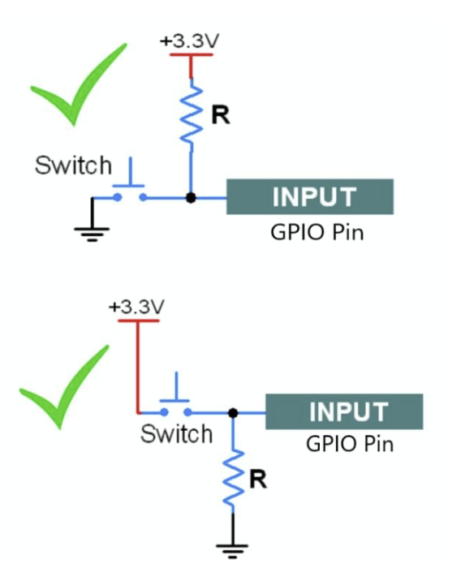

## 📑 Mục lục

1. [Khái niệm GPIO](#khái-niệm-gpio)
2. [Cơ chế hoạt động của GPIO](#cơ-chế-hoạt-động-của-gpio)

   * [Input](#input)
   * [Output](#output)
   * [Alternate Function](#alternate-function)
3. [Push-pull vs Open-drain](#push-pull-vs-open-drain)
4. [Các hàm GPIO quan trọng](#các-hàm-gpio-quan-trọng)

---

## 1. Khái niệm GPIO

**GPIO (General Purpose Input/Output)**
Là các chân tín hiệu trên vi điều khiển MCU, có thể lập trình để hoạt động như **ngõ vào** hoặc **ngõ ra**, tùy theo mục đích sử dụng.

---

## 2. Cơ chế hoạt động của GPIO

### Input

GPIO ở chế độ Input dùng để **đọc tín hiệu từ bên ngoài** như:

* Nút nhấn (button)
* Cảm biến
* Logic từ IC khác

**Đặc điểm:**

* Có thể bật *pull-up* hoặc *pull-down* nội để giữ mức logic khi chân không được kết nối (floating).

---

### Output


GPIO ở chế độ Output dùng để **xuất tín hiệu điều khiển**:

* LED
* Relay
* IC giao tiếp
* Module ngoại vi

Có hai kiểu xuất chính:

#### 1) Push-pull

* Xuất được cả mức **HIGH (1)** và **LOW (0)**.
* Dùng driver mạnh, tín hiệu đẹp, thường là mặc định.

#### 2) Open-drain

* Chỉ có thể xuất **LOW (0)** hoặc **floating (Z)**.
* Mức HIGH phải thông qua **điện trở kéo lên (pull-up)** ngoài hoặc nội.
* Dùng trong bus I²C, các hệ thống cần nhiều thiết bị “kéo xuống”.

---

### Alternate Function

Một chân GPIO có thể có nhiều chức năng khác — ví dụ:

| Chức năng | Mô tả            |
| --------- | ---------------- |
| UART      | TX/RX            |
| SPI       | MOSI/MISO/SCK/CS |
| I²C       | SDA/SCL          |
| PWM       | Output xung      |
| ADC       | Đọc analog       |

GPIO **không chỉ là I/O**, nó còn là cầu nối với các ngoại vi bên trong MCU.

---

## 3. Push-pull vs Open-drain

| Tính năng    | Push-Pull            | Open-Drain                |
| ------------ | -------------------- | ------------------------- |
| Trạng thái   | HIGH / LOW           | LOW / Floating (Z)        |
| Cần pull-up? | Không                | Bắt buộc khi muốn HIGH    |
| Dòng tải     | Mạnh                 | Phụ thuộc điện trở kéo    |
| Ứng dụng     | Điều khiển trực tiếp | Bus chung, nhiều thiết bị |

**Ghi nhớ nhanh:**

* *Push-pull = ép lên, ép xuống.*
* *Open-drain = chỉ kéo xuống, thả thì nổi.*

---

## 4. Các hàm GPIO quan trọng (ESP-IDF)

| Function                     | Tác dụng                             |
| ---------------------------- | ------------------------------------ |
| `gpio_set_level(num, state)` | Xuất mức logic (0 hoặc 1).           |
| `gpio_get_level(num)`        | Đọc trạng thái chân Input.           |
| `gpio_config(&io_conf)`      | Cấu hình mode + pull-up/down + ngắt. |

### Ví dụ cấu hình nhanh

```c
gpio_config_t io_conf = {
    .mode = GPIO_MODE_OUTPUT,
    .pin_bit_mask = 1ULL << GPIO_NUM_2,
    .pull_down_en = 0,
    .pull_up_en = 0
};

gpio_config(&io_conf);
```

---


